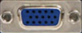

# Tarea
#### Conectores Externos de la placa base

En esta tarea, explicaré los conectores externos del panel lateral de una placa base.

#### 1. Ps/2 para el ratón.

#### 2. Ps/2 para teclado.

#### 3. Puerto paralelo.
Su principal utilidad es como puerto para conectar impresora o escáner.

#### 4. Puerto VGA.
Es el puerto **Video Graphics Array**, se utiliza para enviar señal de vídeo analógica, hacia el monitor por medio de la tarjeta gráfica.

#### 5. Puerto USB.
Sirve para conecta prácticamente cualquier periférico al ordenador.

#### 6. Puerto RJ45.
Para conectarse a internet

#### 7. Jack entrada audio.

Sirve para conectar dispositivos de audio externos.

#### 8. Jack salida audio.

Sirve para conectar dispositivos de audio externos.

#### 9. Jack micrófono.
Sirve para conectar el micrófono a una computadora u otro dispositivo, permitiendo que la señal de audio del micrófono sea capturada por el sistema.
  

